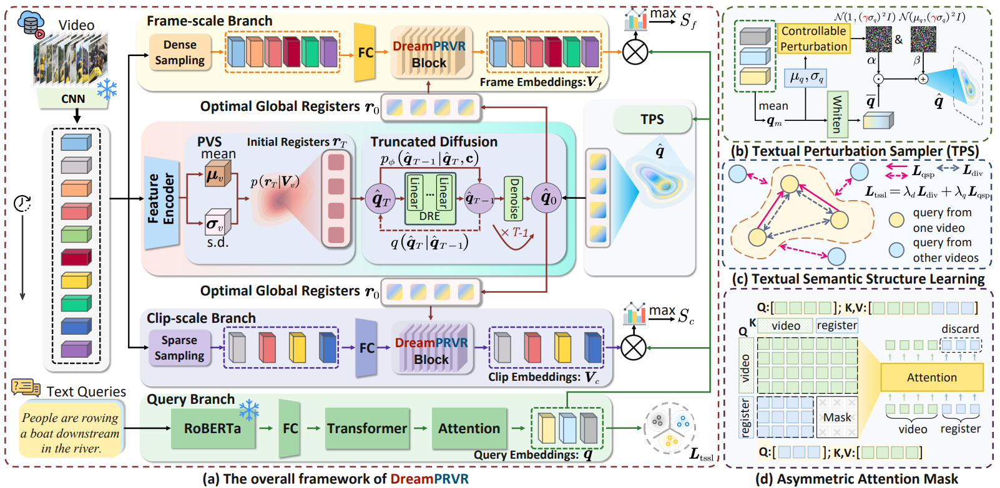

# Imagine Before Concentration: Diffusion-Guided Registers Enhance Partially Relevant Video Retrieval

:star: If **DreamPRVR** is helpful to your  projects, please help star this repo. Thanks! :hugs:
## TABLE OF CONTENTS
- [Imagine Before Concentration: Diffusion-Guided Registers Enhance Partially Relevant Video Retrieval](#imagine-before-concentration-diffusion-guided-registers-enhance-partially-relevant-video-retrieval)
  - [TABLE OF CONTENTS](#table-of-contents)
  - [1. Introduction](#1-introduction)
  - [2. Preparation](#2-preparation)
    - [2.1 Requirements](#21-requirements)
    - [2.2 Download the  datasets](#22-download-the--datasets)
  - [3. Run](#3-run)
    - [3.1 Train](#31-train)
    - [3.2 Retrieval Performance](#32-retrieval-performance)
  - [4. References](#4-references)
  - [5. Acknowledgements](#5-acknowledgements)
  - [6. Contact](#6-contact)

## 1. Introduction
This repository contaithe **PyTorch** implementation of our work at **CVPR 2026**.:

> [**Imagine Before Concentration: Diffusion-Guided Registers Enhance Partially Relevant Video Retrieval**] [Jun Li](https://github.com/lijun2005/), Xuhang Lou, [Jinpeng Wang](https://github.com/gimpong), Yuting Wang, Yaowei Wang, Shu-Tao Xia, Bin Chen.



we propose **DreamPRVR**, which adopts a coarse-to-fine  learning paradigm. 
(i) The model first generates global contextual semantic registers as coarse-grained highlights spanning the entire video and then concentrates on  fine-grained similarity optimization for precise cross-modal matching. Concretely, these registers are generated by  initializing from the video-centric distribution produced by a probabilistic variational sampler and then iteratively refined via a text-supervised truncated diffusion model.
(ii) During this process, textual semantic structure learning constructs a well-formed textual latent space, enhancing the reliability of global perception. 
(iii) The registers are then  fused  with video tokens through register-augmented Gaussian attention blocks, enabling context-aware  learning.

Besides, we invite readers to refer to our previous work [HLFormer](https://github.com/lijun2005/ICCV25-HLFormer), as well as our curated [Awesome-PRVR](https://github.com/lijun2005/Awesome-Partially-Relevant-Video-Retrieval).

In the following, we will guide you how to use this repository step by step. 🤗🐶

## 2. Preparation

```bash
git clone https://github.com/lijun2005/CVPR26-DreamPRVR.git
cd CVPR26-DreamPRVR/
```

### 2.1 Requirements
We train Charades-STA on Nvidia 3080 Ti with the environment:
- python==3.11.8
- pytorch==2.0.1

We train TVR, ActivityNet Captions on Nvidia A100-40G with the environment:
- python==3.9.17
- pytorch==2.0.1


### 2.2 Download the  datasets
All features  can be downloaded from [Baidu pan](https://pan.baidu.com/s/1UNu67hXCbA6ZRnFVPVyJOA?pwd=8bh4) or [Google drive](https://drive.google.com/drive/folders/11dRUeXmsWU25VMVmeuHc9nffzmZhPJEj?usp=sharing) (thanks to [ms-sl](https://github.com/HuiGuanLab/ms-sl)). 

**!!! Please note that we did not use any features derived from ViT.**

The dataset directory is organized as follows:
```bash
DreamPRVR/
    ├── activitynet/
    │   ├── FeatureData/
    │   ├── TextData/
    │   ├── val_1.json
    │   └── val_2.json
    ├── charades/
    │   ├── FeatureData/
    │   └── TextData/
    └── tvr/
        ├── FeatureData/
        └── TextData/
```
We convert the `feature.bin`  into  `feature.hdf5` . Please refer to `src/Utils/convert_hdf5.py` (thanks to [FAWL](https://github.com/BUAAPY/FAWL)).

Finally, set root and data_root in config files (*e.g.*, ./src/Configs/tvr.py `cfg['root']` and `cfg['data_root']`).

## 3. Run
### 3.1 Train 
To train DreamPRVR on ActivityNet Captions:
```
cd src
python main.py -d act --gpu 0
```

To train DreamPRVR on Charades-STA:
```
cd src
python main.py -d cha --gpu 0
```

To train DreamPRVR on TVR:
```
cd src
python main.py -d tvr --gpu 0
```

### 3.2 Retrieval Performance
For this repository, the expected performance is:

| *Dataset* | *R@1* | *R@5* | *R@10* | *R@100* | *SumR* | *Log* |*Ckpt*|
| ---- | ---- | ---- | ---- | ---- | ---- |---- |---- |
| ActivityNet Captions | 8.7 | 27.5 | 40.3 | 79.5 | 156.1 |[act-log](logs/act-log.txt) |[act-ckpt](https://drive.google.com/file/d/1TP0w252kSAfGB1jsfP1WscYWpV97Zbfh/view?usp=sharing)|
| Charades-STA | 2.6 | 8.7 | 14.5 | 54.2 | 80.0 |[cha-log](logs/cha-log.txt) |[cha-ckpt](https://drive.google.com/file/d/1sCshSlUG_WIedjQPSooMgpDno9WkLAj5/view?usp=sharing)|
| TVR | 17.4 | 39.0 | 50.4 | 86.2 | 193.1 |[tvr-log](logs/tvr-log.txt) |[tvr-ckpt](https://drive.google.com/file/d/10UWgj7MBB34G32YFtfE4-Bf-l0zeoP6w/view?usp=sharing)|


## 4. References
If you find our code useful or use the toolkit in your work, please consider citing:

## 5. Acknowledgements
This code is based on  [HLFormer](https://github.com/lijun2005/ICCV25-HLFormer) and [GMMFormerV2](https://github.com/huangmozhi9527/GMMFormer_v2).
We are also grateful for other teams for open-sourcing codes that inspire our work, including 
[MS-SL](https://github.com/HuiGuanLab/ms-sl),
[DiffIR](https://github.com/Zj-BinXia/DiffIR).
## 6. Contact
If you have any question, you can raise an issue or email Jun Li (220110924@stu.hit.edu.cn) and Jinpeng Wang (wangjp26@gmail.com).


